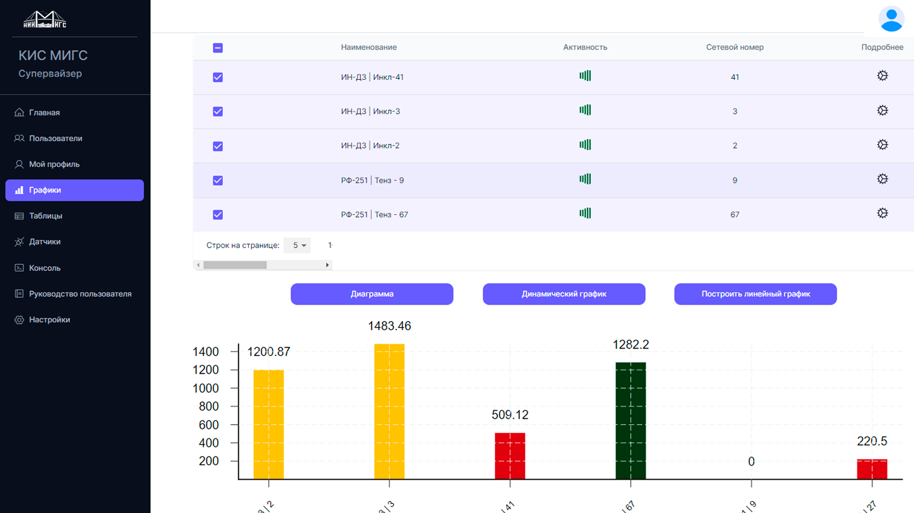

## [Monitoring system KIS MIGS](http://nii-migs.ru)


[]


## Состав приложения

- Frontend (Next.js | MUI)
- Backend (Nest.js)
- PostgresSQL
- Docker


## Quick start

- Clone the repo: `git clone https://github.com/MR-Kornev-Alexey/migs-frontend.git`
- Make sure your Node.js and npm versions are up to date (22 and more)
- Install dependencies: `npm install` or `yarn`
- Start the server: `npm run dev` or `yarn dev`
- Open browser: `http://localhost:3000`

## File Structure

Within the download you'll find the following directories and files:

```
┌── .editorconfig
├── .eslintrc.js
├── .gitignore
├── CHANGELOG.md
├── LICENSE.md
├── next-env.d.ts
├── next.config.js
├── package.json
├── README.md
├── tsconfig.json
├── public
└── src
	├── components
	├── contexts
	├── hooks
	├── lib
	├── styles
	├── types
	└── app
		├── layout.tsx
		├── page_old.tsx
		├── auth
		└── dashboard
```

- Licensed under [MIT](https://github.com/devias-io/material-kit-react/blob/main/LICENSE.md)

## Contact
- Email : alex@mrk.digital
